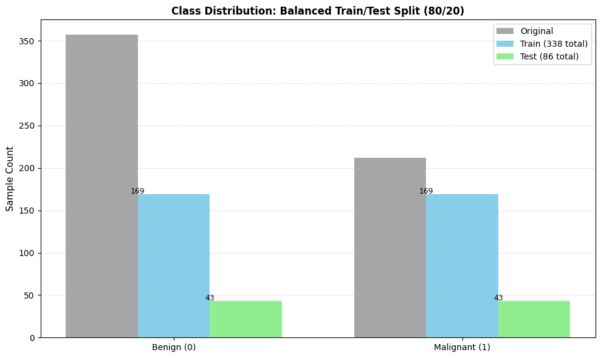
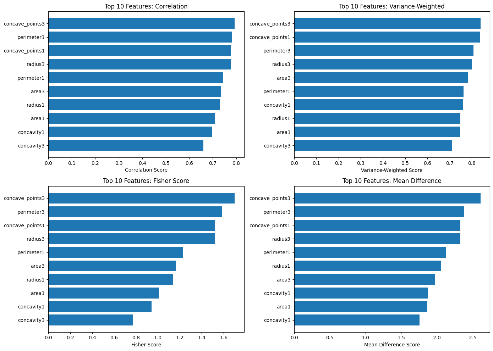
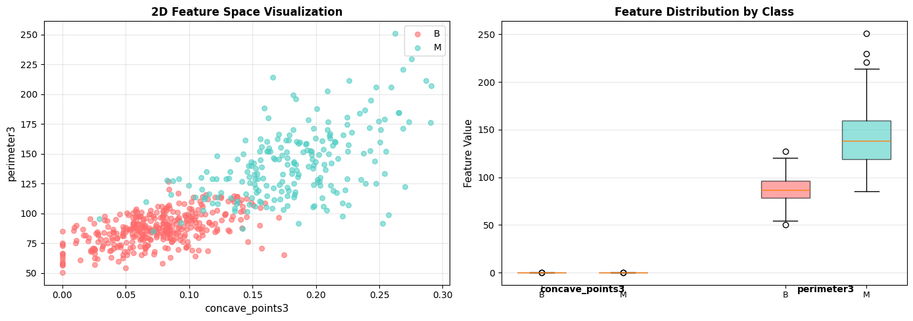
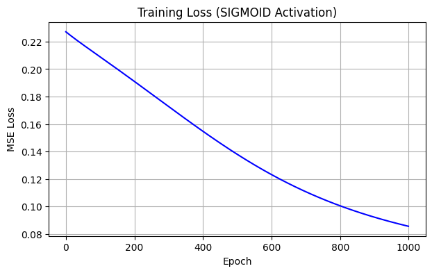
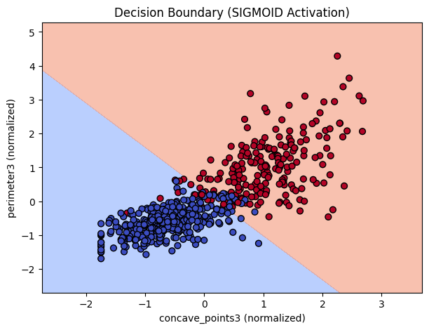
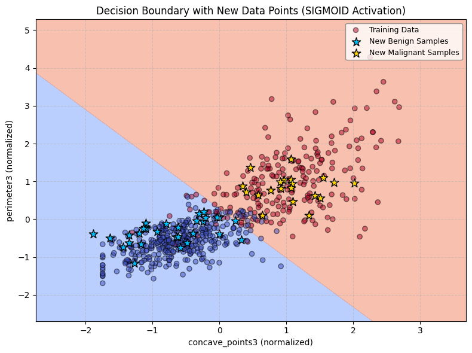

# CSC173 Activity 01 - Neural Network from Scratch

**Date:** October 09, 2025  
**Team:** [Group Name or Members]

## Project Overview

This project implements a simple neural network for binary classification using breast cancer diagnostic data. The network is built completely from scratch using only Python and NumPy, with no machine learning libraries. The goal is to deepen understanding of neural network fundamentals including forward propagation, loss computation, backpropagation, gradient descent training, and model evaluation.

## Data Preparation

We used the Breast Cancer Wisconsin Diagnostic dataset obtained from these sources:
- [Scikit-learn breast cancer dataset](https://scikit-learn.org/stable/modules/generated/sklearn.datasets.load_breast_cancer.html)
- [UCI Machine Learning Repository (Breast Cancer Wisconsin Diagnostic)](https://archive.ics.uci.edu/dataset/17/breast+cancer+wisconsin+diagnostic)  

We selected two features from the dataset for the input layer of the network.

## Network Architecture

- Input layer: 2 neurons (corresponding to selected features)
- Hidden layer: 2 to 4 neurons, activation function: Sigmoid, ReLU, or Tanh
- Output layer: 1 neuron to produce binary classification output

## Implementation Details

- Weight and bias parameters initialized randomly.
- Forward propagation implements layer-wise computations with chosen activation functions.
- Loss computed using Mean Squared Error (MSE).
- Backpropagation calculates gradients of weights and biases.
- Parameters updated using gradient descent.
- Training performed for 500 to 1000 iterations.

## Summary of Approach

This notebook analyzes the **Breast Cancer Wisconsin Diagnostic Dataset** from the **UCI Machine Learning Repository** to explore, preprocess, and identify the most relevant features for cancer diagnosis classification.


### 1. Data Loading and Exploration

The dataset was retrieved using the `ucimlrepo` library (Dataset ID 17).

Features (`X_df`) and target labels (`y_df`) were extracted and inspected using standard pandas functions.

Initial exploration confirmed that the dataset was clean, contained **30 numerical features** describing **cell nucleus characteristics**, and required minimal preprocessing.


### 2. Target Preparation

The target variable (`diagnosis`) was encoded into numeric form — **Malignant = 1**, **Benign = 0** — to enable mathematical and statistical computation.

Class distribution was checked to ensure proper balance and correctness before analysis.

Using 80/20 split for Training and Testing Datasets:



### 3. Feature Selection

To determine which features are most predictive of cancer diagnosis, **four complementary statistical methods** were applied:

#### **Method 1: Pearson Correlation**
Measures the **linear relationship** between each feature and the target label using covariance and standard deviation.  
Features with higher absolute correlations are more strongly associated with malignancy.

#### **Method 2: Variance-Weighted Correlation**
Enhances correlation analysis by weighting each feature’s correlation score according to its variance, emphasizing features with greater informative spread.

#### **Method 3: Fisher Score**
Evaluates how well each feature separates the two diagnosis classes (malignant vs. benign) by comparing **between-class mean differences** relative to **within-class variance**.

#### **Method 4: Mean Difference Analysis**
Computes the absolute difference between malignant and benign feature means to identify the most discriminative measurements.

## Results & Visualization
- The two features that were used to train the neural network based on the abovementioned statistical tools are `['concave_points3', 'perimeter3']`.
    - Features Feed to Statistical Tools

    

    - Choosen Features Visualization

    
- Using the following parameters:
```python
    activation = 'sigmoid'
    hidden_neurons = 4
    epochs = 1000
    learning_rate = 0.05
```

### The results are:
- Model accuracy: `94.19%`
- Training Loss Graph



- Decision Boundary



- Decision Boundary for New Data Points


## Key Results
Based on the analysis of the **Wisconsin Diagnostic Breast Cancer dataset**, the features **`concave_points3`** and **`perimeter3`** were observed to be the most predictive for distinguishing between Malignant and Benign diagnoses using several statistical methods. After **normalizing** these features, **balancing** the dataset through undersampling, and splitting it into **80% training** and **20% testing** sets, a simple neural network was trained from scratch. This network, configured with **4 hidden neurons**, **sigmoid activation**, a learning rate of **0.05**, and trained for **1000 epochs**, demonstrated effective learning, as seen by the decreasing loss curve. It achieved a notable accuracy of **94.19%** on the unseen test data. The decision boundary visualization confirmed the model's ability to separate the classes in the feature space, and it successfully predicted outcomes for new, synthetic data points.
## Team Collaboration

Each member contributed to different components of the network:
- Weight and bias initialization
- Forward propagation coding
- Loss function implementation
- Backpropagation and gradient computation
- Training loop and visualization

## How to Run

1. Clone the GitHub repository:
   ```
   git clone https://github.com/caineirb/CSC173-Activity-01---Neural-Network-from-Scratch.git
   ```
2. Open the Jupyter notebook or Colab file.
3. Run all cells sequentially.
4. Explore training loss plot and decision boundary visualizations.

## Summary

This activity provided hands-on experience in building a neural network without relying on high-level ML frameworks. The group collaboratively developed the model, analyzed its training behavior visually, and demonstrated understanding of fundamental AI concepts through both code and documentation.

Video: [Video Presentation Link](https://drive.google.com/file/d/1hp77d9IUQeOedJHwJN3LTnWwP_vlcXzp/view?usp=sharing)